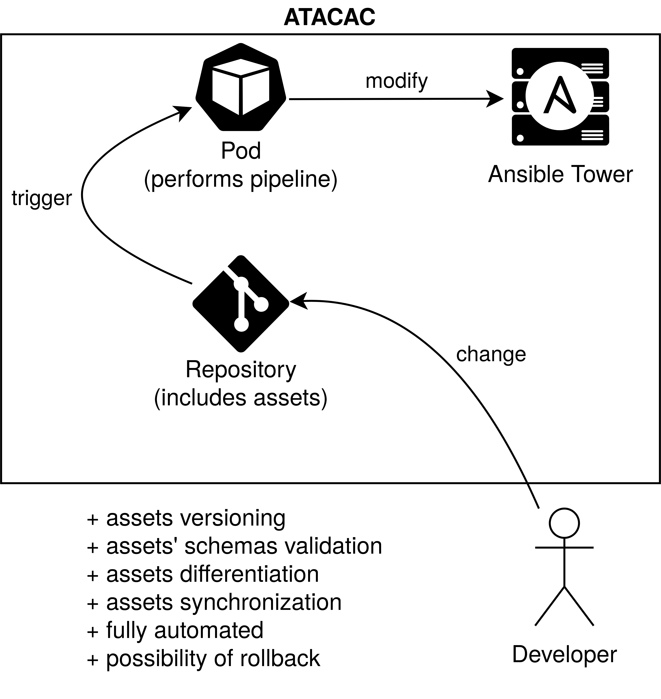

# ATACAC - Ansible Tower Asset Config As Code

### Preface

Maintaining dozens of Ansible Tower assets configurations (job templates, projects, inventories, etc.) is very difficult. Currently, there is no mechanism for the Ansible Tower asset configurations' management. By adopting Configuration-as-Code (CaC) practice (very similar to Infrastructure-as-code (IaC)) there is an open way how to store, manage, and maintain the configurations in one place. The available Continuous-Integration/Continuous-Delivery (CI/CD) technologies were used for automation of this project's parts. This project started as a proof-of-concept (experiment/pilot project) implementing the configuration-as-code (management) and continuous-integration/continuous-delivery (automation) practices' approach.

* configuration-as-code
    * Eric Goebelbecker - [CaC](https://rollout.io/blog/configuration-as-code-everything-need-know/)
    * Wikipedia - [IaC](https://en.wikipedia.org/wiki/Infrastructure_as_code)
* continuous-integration/continuous-delivery
    * Martin Fowler - [CI](https://martinfowler.com/articles/continuousIntegration.html) / [CD](https://martinfowler.com/bliki/ContinuousDelivery.html)
    * Wikipedia - [CI/CD](https://en.wikipedia.org/wiki/CI/CD)

The above-mentioned problems are resolved in the project implementation, which provides an automated way for storage, management, and maintenance of existing configurations available in Ansible Tower. This project started from scratch as an experiment, which later resulted in a complete usable implementation that is still in the progress of development.

### About

This repository provides a template (a repository skeleton) that can be used for each project-specific repositories. For now, it is required to use a GitLab environment while the GitHub actions are not supported yet. The [documentation](docs/README.md) includes the guidance, explanation, know-how, and FAQ.

### Setup

The documentation including setup description can be found in [`docs/README.md`](docs/README.md).

### Contribution

Feel free to open an [issue](https://github.com/europ/atacac/issues) or a [change request](https://github.com/europ/atacac/pulls) in this repository in case of a bug, problem, request for enhancement, feature idea, suggestion, etc.
