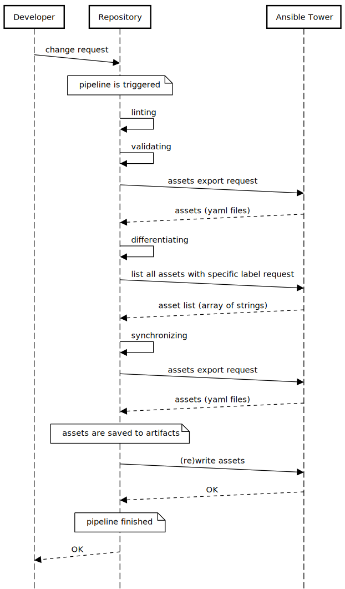
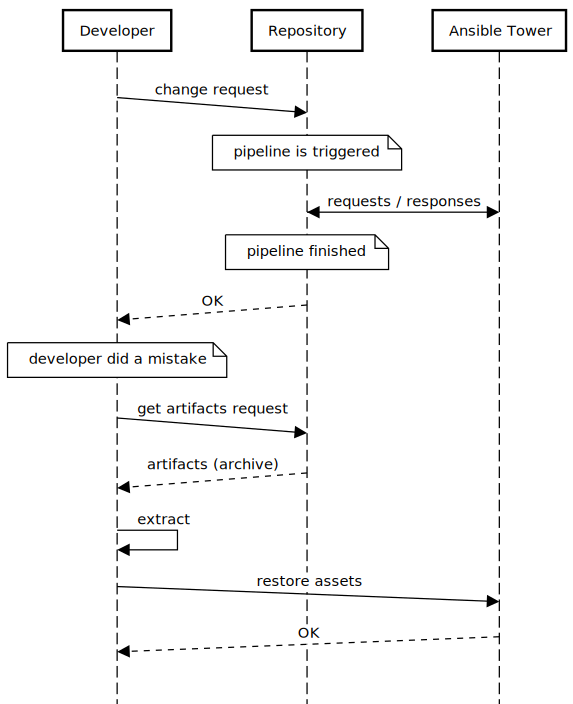
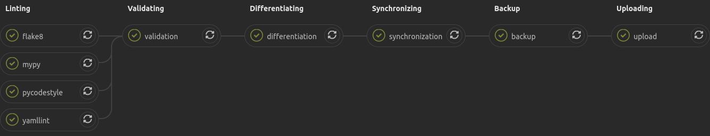
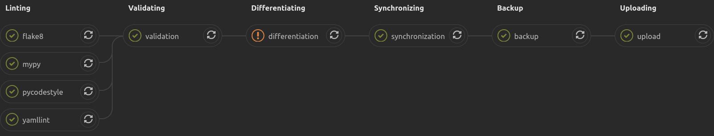
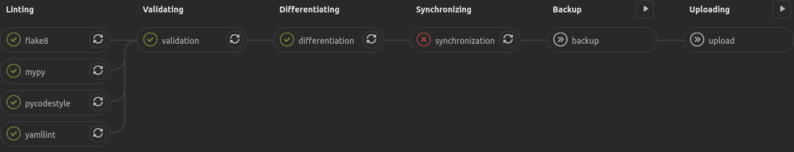
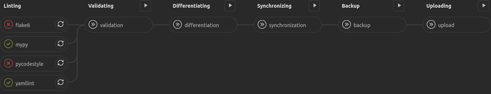
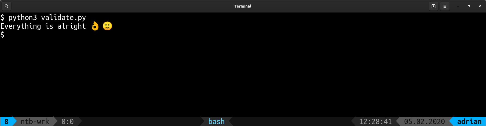
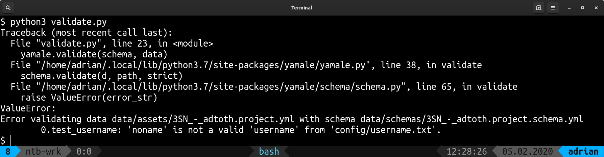

# Documentation

## Table of Contents

1. [Setup](#setup)
    1. [Prerequisites](#prerequisites)
    1. [Configuration](#configuration)
        1. [Remote](#remote)
        1. [Local](#local)
        1. [Fork and Customize](#fork-and-customize)
    1. [Usage](#usage)
        1. [Scripts](#scripts)
        1. [Environment Variables](#environment-variables)
            1. [Ansible Tower](#ansible-tower)
            1. [GitLab](#gitlab)
        1. [Schema](#schema)
1. [Workflow](#workflow)
    1. [Sequence Diagrams](#sequence-diagrams)
        1. [Change Request](#change-request)
        1. [Restore Backup](#restore-backup)
1. [Structure](#structure)
1. [Examples](#examples)
    1. [Pipeline](#pipeline)
    1. [Validation](#validation)
1. [FAQ](#frequently-asked-questions)
    1. [Why tower cli?](#why-tower-cli)
    1. [Why are labels important?](#why-are-labels-important)
    1. [Will ATACAC delete Tower assets?](#will-atacac-delete-tower-assets)
    1. [Why is the pipeline failing on 'differentiation' but still continuing?](#why-is-the-pipeline-failing-on-differentiation-but-still-continuing)
1. [Future Work](#future-work)
1. [Notes](#notes)

## Setup

### Prerequisites

1. GitLab environment
    1. Domain
        * e.g. `https://your.gitlab.domain.com/`
    1. Repository
        * e.g. `owner/repository`
    1. Account
        * has all the necessary permissions to the repository
        * personal access token, e.g. `efgh5678`
            * `api` scope
1. Ansible Tower
    1. Ansible Tower server
        * URL of the host, e.g. `https://your.tower.domain.com/`
    1. Ansible Tower account with sufficient permissions for read and modify
        * username, e.g. `towerbot`
        * password, e.g. `abcd1234`
1. [python3](https://www.python.org/)
1. python3 [pip](https://github.com/pypa/pip)
1. python3 packages
    * see `requirements.txt` for package list
    * install all via `python3 -m pip install -r requirements.txt`

### Configuration

#### Remote

1. Create new project
    1. create new project GitLab as you are used to do
    1. download `.TEMPLATE.gitlab-ci.yml` and add it to your project
1. Go to your project repository
1. Enable GitLab runner for the project
    1. Open `CI/CD` settings
    1. Expand `Runners` section
    1. Add specific runners or use shared runners
1. Add environment variables to the project
    * Key `TOWER_HOST` with `https://your.tower.domain.com/` value
    * Key `TOWER_USERNAME` with `towerbot` value
    * Key `TOWER_PASSWORD` with `abcd1234` value
    * Key `TOWER_VERIFY_SSL` with `false` value
1. Add assets (YAML files) to the repository (folder, eg. `data/assets/`)
    * You can download the already existing ones with `podman run --rm -v $PWD:/workdir:Z quay.io/redhat-aqe/atacac backup <LABEL_ID> /workdir/data/assets`
1. Configure the validation scheme stored in `data/schemas/`
    * You can check asset validating schema locally via `podman run --rm -v $PWD:/workdir:Z -e ASSETS_GLOB="/workdir/data/assets/*.yml" -e ASSETS_SCHEMA=/workdir/<schema-path> quay.io/redhat-aqe/atacac validate`
1. Rename `.TEMPLATE.gitlab-ci.yml` to `.gitlab-ci.yml`
1. Fill in placeholders in `.gitlab-ci.yml`, they are marked with `<TODO>`
    * Find the placeholder(s) via `grep -nF '<TODO>' .gitlab-ci.yml` and replace them
    * To find the corresponding ID to the label run `tower-cli label list -a`
1. Rename `TEMPLATE.README.md` to `README.md`
    * Add valid values to the placeholders

#### Local

1. Configured Ansible Tower CLI
    * <https://tower-cli.readthedocs.io/en/latest/>
    * add `host`, `username`, `password`, and `verify_ssl` as `false`
        * as environment variables or stored in `~/.tower_cli.cfg`
1. Clone of your forked repository including the desired assets
1. Export environment variables
    * `GITLAB_URL` with `https://your.gitlab.domain.com/`
    * `GITLAB_TOKEN` with `efgh5678`
    * `GITLAB_PROJECT` with `owner/repository`
1. Verify your local repository settings by running `tox` (or `tox --recreate`)
    * differentiate may fail on found differences
    * synchronize will fail because the `Label ID` is passed via pipeline (expected)
    * backup will fail becuase the `PATH_BACKUP` environment variable is set via pipeline
        * to fix it run `export PATH_BACKUP=/tmp/backup`

#### Fork and Customize

If you want to make your own customizations for or create repository derivation
of this project. Then you will also need manage updates/fixes on your own.

How to create derived repository;

1. open GitLab
1. click on `New Project` button
1. click on `Import Project` tab
1. click on `git Repo by URL`
1. insert `https://this.repository.url.git`
1. finish the configuration
    * choose project name, slug, and URL
1. click on `Create project` button

### Usage

```sh
docker run --rm -v "$PWD:/workdir:Z" quay.io/redhat-aqe/atacac <command> <args...>
```

Or start interactive shell in the container and launch commands via `atacac`
wrapper (eg. `atacac backup` to run `backup` command);

```sh
docker run --rm -v "$PWD:/workdir:Z" --entrypoint /bin/bash -it quay.io/redhat-aqe/atacac
```

#### Scripts

Each core functionality has its specific command that is described below.

| File                                       | Usage                             | Description                                                                                                    |
| :----------------------------------------- | :-------------------------------- | :------------------------------------------------------------------------------------------------------------- |
| [`backup`](atacac/backup.py)               | `backup <label ID> <folder path>` | downloads the actual Tower assets that are marked by a specific label from tower to a folder                   |
| [`differentiate`](atacac/differentiate.py) | `differentiate`                   | differentiates the actual repository assets' attributes with actual Tower assets                               |
| [`restore`](atacac/restore.py)             | `restore <pipeline ID>`           | downloads job artifacts archive (backup of assets), extracts the archive locally, uploads the content to Tower |
| [`synchronize`](atacac/synchronize.py)     | `synchronize <label ID>`          | check if the repository's assets exits in Tower under a specific label and vice versa                          |
| [`upload`](atacac/upload.py)               | `upload`                          | rewrite the corresponding Ansible Tower assets with repository assets                                          |
| [`validate`](atacac/validate.py)           | `validate`                        | validates the assets with rules defined in the schema                                                          |

#### Environment Variables

The table below defines which environment variables are required for each command.

| File                                       | Required Environment Variables                     |
| :----------------------------------------- | :------------------------------------------------- |
| [`backup`](atacac/backup.py)               | [Ansible Tower](#ansible-tower)                    |
| [`differentiate`](atacac/differentiate.py) | [Ansible Tower](#ansible-tower)                    |
| [`restore`](atacac/restore.py)             | [Ansible Tower](#ansible-tower), [GitLab](#gitlab) |
| [`synchronize`](atacac/synchronize.py)     | [Ansible Tower](#ansible-tower)                    |
| [`validate`](atacac/validate.py)           | [Ansible Tower](#ansible-tower)                    |

##### Ansible Tower

* `TOWER_HOST`
* `TOWER_USERNAME`
* `TOWER_PASSWORD`
* `TOWER_VERIFY_SSL`
    * set to `false`

##### GitLab

* `GITLAB_URL`
* `GITLAB_TOKEN`
    * `api` scope
* `GITLAB_PROJECT`
    * `owner/repository` format

#### Schema

Documentation is available at [github.com/23andMe/Yamale](https://github.com/23andMe/Yamale).

|               | Location                         |
| :------------ | :------------------------------- |
| used in       | [`validate`](atacac/validate.py) |
| stored in     | [`data/schemas/`](/data/schemas) |
| customized in | [`validators/`](validators)      |

## Workflow

The repository must include runner, assets in `data/assets/` folder, credentials stored in environment variables, and the required implementation for validation, tower interaction, and further configuration. The pipeline defined in `.gitlabl-ci.yml` is triggered for each change request (such as commit) including the following pipeline stages:

* linting
    * static analysis of the files in the repository
* validating
    * asset validation based on the schema (defined in `atacac/validate.py`)
* differentiating
    * asset differentiation between current stored assets and current Ansible Tower assets (defined in `atacac/differentiate.py`)
* synchronizing
    * check for new or removed assets tagged with a specific label in the Ansible Tower (defined in `atacac/synchronize.py`)
* backup
    * download and store the files to the given folder from Ansible Tower (defined in `atacac/backup.py`)
* uploading
    * rewrite the corresponding Ansible Tower assets with repository assets

The automated workflow does not restore the backup stored in the job's artifacts. Each pipeline run stores the actual assets located in the Ansible Tower into a [job artifact](https://docs.gitlab.com/ee/ci/pipelines/job_artifacts.html) (in our case called backup) before it will write (upload) anything to the Ansible Tower. This artifact is an archive including the actual assets that are downloaded. If something went wrong, there is a possibility to turn in back by doing a backup restore via [`restore`](ratacac/estore.py), which must be done manually.

The restoration process requires to have a successful backup that is stored as a [job artifact](https://docs.gitlab.com/ee/ci/pipelines/job_artifacts.html) and a pipeline ID that includes the job artifact. The whole process is performed on a developers local machine. It is needed to execute `python3 restore.py <Pipeline ID>`, which will download the artifacts archive, extract the archive, upload the containing files to the Ansible Tower. The interactions inside of the restoration process are shown in sequence diagram below - [Restore Backup](#restore-backup).

### Sequence Diagrams

#### Change Request



#### Restore Backup



## Example Structure

```txt
├── assets ................................ ansible tower assets stored in repository
│   ├── <asset_name>.yml .................. 'asset name' asset
│   └── ...
├── schemas ............................... asset validation schemas
│   ├── <asset_name>.schema.yml ........... 'asset name' schema for '<asset_name>.yml'
│   └── ...
├── validators ............................ custom yamale validators
│   ├── custom.py ......................... python source code with validators
│   └── ...
├── .yamllint ............................. yamllint configuration
├── .gitlab-ci.yml ........................ CI configuration
└── ...
```

See also [directory with example repository](../example)

## Example Pipeline

#### Success



#### Warning

* attribute(s) changed of an existing asset in Ansible Tower



#### Failed (intended)

* completely new asset(s) was(were) added to Ansible Tower which are not available in the repository



#### Failed (unintended)

* an introduced mistake, e.g. broken style guide



### Validation

#### Success



#### Error



## Frequently Asked Questions

### Why tower cli?

1. it does what is needed even it's deprecated
    * dump (list) labeled assets
    * upload (send/import) asset(s)
    * download (receive/export) asset(s)
1. newer cli is not ready yet which is suppose to replace this one
1. it's required functions were wrapped so it is easy to migrate to other (newer) CLI
    * to migrate from `tower-cli` you just need to change few lines in **three** functions located in file `atacac/_utils.py`; `tower_list`, `tower_receive` and `tower_send`.

### Why are labels important?

Labels are how we identify assets in Tower. Labels allow us to specify a category of assets and also to identify when we have extra assets in Tower which don't exist in configuration. One use case is when we want to remove an asset, if we remove it from configuration but not from Tower then the pipeline will fail and let us know.

### Will ATACAC delete Tower assets?

No, by design ATACAC will never delete assets. While deletion may be rolled back, the newly created asset will have a different ID in Tower and this may break some users of templates. Also as a safety reason, we don't want to accidentally delete things. We think there should be a human taking these decisions for now.

### Why is the pipeline failing on 'differentiation' but still continuing?

This step should signify that new assets are added to Tower (they exist in config, but not in Tower yet). For now this is the method we use, we can eventually switch to just a warning.

## Future Work

* resolve duplicated asset downloading
    * differentiate and backup job could be merged into one
* add a way to test changes using Stage Tower (pre-merge) when post-merge we apply changes to Prod Tower would require two sets of credentials

## Notes

* `ansible-tower-cli` does not export `verbosity` if it is set to `0`
